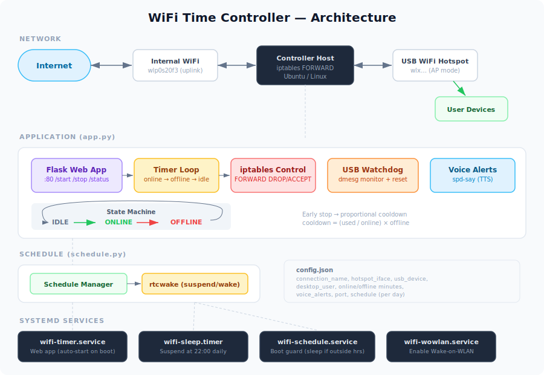

# WiFi Time Controller

A parental-control-style system that manages WiFi internet access through a timed hotspot. Users connect to a shared WiFi hotspot and must click "Start" on a web page to get internet access for a limited time. When time runs out, internet is blocked for a cooldown period before they can start again.

## Architecture



## How It Works

1. The computer connects to an existing WiFi network for internet via the internal WiFi card.
2. A USB WiFi adapter broadcasts a hotspot SSID.
3. Devices connect to the hotspot and visit the gateway IP to see the timer page.
4. Internet access is controlled by **iptables FORWARD rules** — not by turning WiFi on/off — so the web page is always reachable.

### Internet Control Flow

| State   | WiFi Connected | Web Page | Internet | Button     |
|---------|----------------|----------|----------|------------|
| Idle    | Yes            | Yes      | Blocked  | Start      |
| Online  | Yes            | Yes      | Allowed  | Stop       |
| Offline | Yes            | Yes      | Blocked  | (disabled) |

- **Idle** — WiFi is on, but internet is blocked. User clicks **Start**.
- **Online** — Internet is allowed. A countdown timer runs (default: 40 minutes). Voice alerts announce remaining time at 10, 5, and 1 minute.
- **Offline (cooldown)** — Internet is blocked again. Cooldown timer runs (default: 15 minutes), then returns to Idle.

### Early Stop & Proportional Cooldown

If the user clicks **Stop** before the timer expires, the cooldown is proportional to the time used:

```
cooldown = (time_used / online_time) * offline_time
```

Examples (with 40 min online / 15 min offline):
- Used 40 min (100%) → 15 min cooldown
- Used 20 min (50%) → 7.5 min cooldown
- Used 10 min (25%) → 3.75 min cooldown

## File Structure

```
wifi-time-controller/
├── app.py                  # Flask web app + iptables control
├── config.json             # Your configuration (git-ignored)
├── config.example.json     # Example configuration (commit this)
├── schedule.py             # Sleep/wake schedule manager
├── start.sh                # Manual start (sudo python3 app.py)
├── stop.sh                 # Manual stop + iptables cleanup
├── install.sh              # Install systemd services
├── uninstall.sh            # Remove systemd services
├── wifi-timer.service      # systemd: web app service (template)
├── wifi-schedule.service   # systemd: boot guard (template)
├── wifi-sleep.service      # systemd: suspend trigger (template)
├── wifi-sleep.timer        # systemd: fires at 22:00 daily
└── architecture.svg        # Architecture diagram
```

## Configuration

Copy `config.example.json` to `config.json` and edit it:

```bash
cp config.example.json config.json
```

```json
{
    "connection_name": "my-hotspot",
    "hotspot_iface": "wlxXXXXXXXXXXXX",
    "usb_device": "1-4",
    "desktop_user": "your-username",
    "online_minutes": 40,
    "offline_minutes": 15,
    "voice_alerts": [10, 5, 1],
    "port": 80,
    "schedule": {
        "mon": {"start": "16:00", "end": "22:00"},
        "tue": {"start": "16:00", "end": "22:00"},
        "wed": {"start": "16:00", "end": "22:00"},
        "thu": {"start": "16:00", "end": "22:00"},
        "fri": {"start": "16:00", "end": "22:00"},
        "sat": {"start": "07:00", "end": "22:00"},
        "sun": {"start": "07:00", "end": "22:00"}
    }
}
```

| Field | Description |
|---|---|
| `connection_name` | NetworkManager connection name for the hotspot |
| `hotspot_iface` | USB WiFi adapter interface name (find with `ip link show`). **Note:** interface names (e.g. `wlan0`, `wlan2`) can change after kernel/driver updates — if the hotspot stops working after an update, verify the interface name matches |
| `usb_device` | USB bus-port (find with `lsusb` or check `dmesg`) |
| `desktop_user` | Linux desktop username (for voice alerts via PipeWire/PulseAudio) |
| `online_minutes` | How long internet is allowed after clicking Start |
| `offline_minutes` | Maximum cooldown duration (when full time is used) |
| `voice_alerts` | Minutes remaining when voice alerts are spoken |
| `port` | Web server port |
| `schedule` | Daily start/end times for computer availability |

### Finding Your Configuration Values

```bash
# Find USB WiFi interface name
ip link show

# Find USB bus-port (look for your adapter's chipset)
lsusb
# Then check dmesg for the bus-port, e.g. "1-4:1.0"
sudo dmesg | grep -i "wifi\|wlan\|rtw\|ath\|mt76"

# Find your username
whoami
```

## Suspend & Wake Mechanism

The computer follows a daily schedule — it sleeps outside allowed hours and automatically wakes up when the next session begins. This is powered by **rtcwake** and **systemd timers**.

### What is rtcwake?

Every computer has a **Real-Time Clock (RTC)** — a small battery-powered hardware clock that keeps ticking even when the computer is off or suspended. `rtcwake` is a Linux command that:

1. Sets an **alarm** in the RTC hardware (like setting an alarm clock).
2. **Suspends** the computer to RAM (`mem` mode — very low power, preserves state).
3. When the RTC alarm fires, the hardware **wakes the computer** from suspend.

This works even with the lid closed, because the RTC is independent of the OS.

### How the Schedule Works

Three systemd units work together:

#### 1. `wifi-sleep.timer` — Daily Suspend Trigger
Fires every day at **22:00**. Runs `schedule.py sleep`, which:
- Calculates the next scheduled wake time.
- Calls `rtcwake -m mem -s <seconds>` to suspend and set the RTC alarm.

```
22:00 (every day)
  │
  ├─ Mon night → rtcwake sets alarm for Tue 16:00 (18 hours)
  ├─ Tue night → rtcwake sets alarm for Wed 16:00 (18 hours)
  ├─ Wed night → rtcwake sets alarm for Thu 16:00 (18 hours)
  ├─ Thu night → rtcwake sets alarm for Fri 16:00 (18 hours)
  ├─ Fri night → rtcwake sets alarm for Sat 07:00 (9 hours)
  ├─ Sat night → rtcwake sets alarm for Sun 07:00 (9 hours)
  └─ Sun night → rtcwake sets alarm for Mon 16:00 (18 hours)
```

#### 2. `wifi-schedule.service` — Boot Guard
Runs once at boot. If the computer is started **outside** scheduled hours (e.g., someone presses the power button at 2 AM), it immediately calculates the next wake time and suspends again.

```
Boot
  │
  ├─ Within schedule? → Stay awake, start services normally.
  └─ Outside schedule? → Calculate next wake time → rtcwake suspend.
```

#### 3. `wifi-timer.service` — Web App
Starts the Flask web app on boot. Runs as root so it can manage iptables rules and bind to port 80.

### Suspend vs Power Off

The system uses **suspend to RAM** (`mem`), not power off:

| | Suspend (mem) | Power Off |
|---|---|---|
| Power usage | Very low (~0.5W) | Zero |
| Wake speed | Instant (~2 seconds) | Full boot (~30 seconds) |
| RTC wake | Supported | Requires BIOS/UEFI support |
| State preserved | Yes (RAM stays powered) | No |

Suspend is preferred because:
- RTC wake is universally supported in suspend mode.
- The computer resumes instantly with all services running.
- Battery drain is minimal (laptop can suspend for days).

### Lid Behavior

The installer configures lid close to **lock the screen** instead of suspending:

- Closing the lid → screen locks, computer stays running.
- The hotspot and web app continue to work with the lid closed.
- Suspend only happens at the scheduled end time via the timer.

#### Lid Wake vs RTC Wake

By default, opening the laptop lid will wake the computer from suspend — **even if the RTC alarm hasn't fired yet**. This means if the computer is suspended until 16:00 but someone opens the lid at 04:00, it wakes up immediately.

To prevent this, disable the LID ACPI wake source:

```bash
# Disable (takes effect immediately, resets on reboot)
echo LID | sudo tee /proc/acpi/wakeup

# To make it permanent, create a systemd service:
sudo tee /etc/systemd/system/disable-lid-wakeup.service > /dev/null << 'EOF'
[Unit]
Description=Disable LID as ACPI wake source
After=multi-user.target

[Service]
Type=oneshot
ExecStart=/bin/bash -c 'grep -q "LID.*enabled" /proc/acpi/wakeup && echo LID > /proc/acpi/wakeup || true'

[Install]
WantedBy=multi-user.target
EOF

sudo systemctl enable disable-lid-wakeup.service
```

With LID wake disabled, the computer can only be woken by the **RTC alarm** (scheduled wake) or the **power button**.

### USB WiFi Watchdog

The app includes a watchdog thread that monitors `dmesg` for USB WiFi firmware errors. If the adapter firmware enters a bad state (common with some Realtek drivers), the watchdog automatically:

1. Unbinds the USB device
2. Rebinds it (forces firmware reload)
3. Restarts the hotspot connection
4. Restores iptables rules
5. Announces "WiFi adapter recovered" via voice

## Installation

### Prerequisites

- Ubuntu/Debian with NetworkManager
- USB WiFi adapter (must support AP mode)
- Python 3 with Flask (`sudo apt install python3-flask`)
- `spd-say` for voice alerts (usually pre-installed)

### Setup the Hotspot (one-time)

Replace the values below with your own:

```bash
sudo nmcli connection add type wifi ifname <your-iface> con-name <your-ssid> \
    autoconnect yes ssid <your-ssid> \
    -- wifi.mode ap wifi.band bg wifi.channel 6 \
    wifi-sec.key-mgmt wpa-psk wifi-sec.psk "<your-password>" \
    wifi-sec.wps-method 1 \
    ipv4.method shared ipv4.addresses 192.168.44.1/24

sudo nmcli connection up <your-ssid>
```

### Configure

```bash
cp config.example.json config.json
# Edit config.json with your values
```

### Install the Service

```bash
sudo bash install.sh
```

This will:
1. Stop any running instance
2. Configure lid close to lock screen
3. Install and enable all systemd services
4. Start the web app immediately

### Uninstall

```bash
sudo bash uninstall.sh
```

This will:
1. Stop and disable all services
2. Remove systemd unit files
3. Clean up iptables rules
4. Restore lid close to default (suspend)

### Manual Start/Stop (without systemd)

```bash
sudo python3 app.py        # start
# or
sudo bash start.sh          # start (background)
sudo bash stop.sh            # stop
```

## Useful Commands

```bash
# Check service status
sudo systemctl status wifi-timer
sudo systemctl status wifi-sleep.timer

# View next scheduled wake time
sudo python3 schedule.py next

# Check if currently in schedule
sudo python3 schedule.py check

# View iptables rules
sudo iptables -L FORWARD -v --line-numbers

# View hotspot status
nmcli device status

# Restart after config change
sudo systemctl restart wifi-timer
```

## Voice Alerts

The system uses `spd-say` (speech-dispatcher) for voice announcements. Set `desktop_user` in config to enable.

| Event | Voice |
|---|---|
| Click Start | "WiFi started. 40 minutes." |
| 10 min remaining | "10 minutes remaining" |
| 5 min remaining | "5 minutes remaining" |
| 1 min remaining | "Last 1 minute!" |
| Timer expires | "Time is up. WiFi paused." |
| Click Stop | "WiFi stopped. Cooldown X minutes." |
| Adapter recovered | "WiFi adapter recovered." |

Configure which alerts fire via `voice_alerts` in `config.json`.

### PipeWire loses audio after suspend/resume

On some Linux systems, PipeWire fails to re-detect audio hardware after a suspend/resume cycle, falling back to a **Dummy Output**. This silently breaks voice alerts.

**Fix:** Create a system-sleep hook to restart PipeWire on resume:

```bash
sudo tee /usr/lib/systemd/system-sleep/restart-pipewire.sh > /dev/null << 'EOF'
#!/bin/bash
if [ "$1" = "post" ]; then
    sleep 3
    sudo -u YOUR_USER XDG_RUNTIME_DIR=/run/user/YOUR_UID \
        DBUS_SESSION_BUS_ADDRESS=unix:path=/run/user/YOUR_UID/bus \
        systemctl --user restart pipewire pipewire-pulse wireplumber
fi
EOF
sudo chmod +x /usr/lib/systemd/system-sleep/restart-pipewire.sh
```

Replace `YOUR_USER` and `YOUR_UID` with the desktop user and their UID (e.g. `id -u kali`).

## Security

- **WPA2-PSK** encryption on the hotspot
- **WPS disabled** (prevents brute-force attacks)
- **iptables** controls internet access at the network layer
- The web app runs on the hotspot subnet — not exposed to the internet
- The app requires root to run (for iptables and port 80)
- `config.json` is git-ignored (contains device-specific settings)
